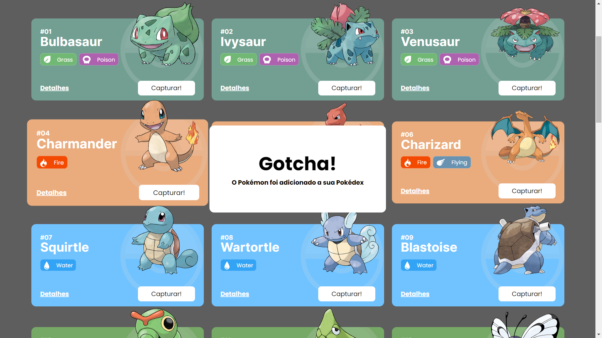

# `Projeto`
Projeto Pokedex Desktop

# `Link`
https://fresh-hat.surge.sh/

# `Descrição`
O projeto foi desenvolvido com base na API pública https://pokeapi.co/. Ela oferece uma grade variedade de informações sobre o universo Pokémon.
  
Meu objetivo era criar um meio visual de ilustrar algumas dessas informações através do desenvolvimento de um site desktop.

# `Modo de usar`
Ao iniciar a aplicação, o usuário é direcionado à página inicial do site, onde consegue ver uma lista com todos os pokémons.
  
Nessa página ele consegue clicar no botão "Detalhes" de cada pokemon, e então ser direcionado para outra página, que lista seus atributos, como: hp, ataque, defesa, também seus ataques e sprites.
  
Ainda na página inicial, é possível capturar um pokemon, clicando no botão "Capturar!". Ao fazê-lo, o pokemon capturado é adicionado a pokédex (lista de pokemons capturados), que pode ser acessada pelo botão "Pokédex", localizado no canto superior direito do site.

# `Instalando e rodando o projeto`
Fazer o clone do projeto:
- git clone link-do-repositório

Instalar as dependências:
- npm install

Rodar o projeto:
- npm run start

# `Tecnologias utilizadas`

# `Imagens`
### Página Inicial

### Ao Capturar Pokémon

### Página Detalhes Pokémon

### Página Pokédex

